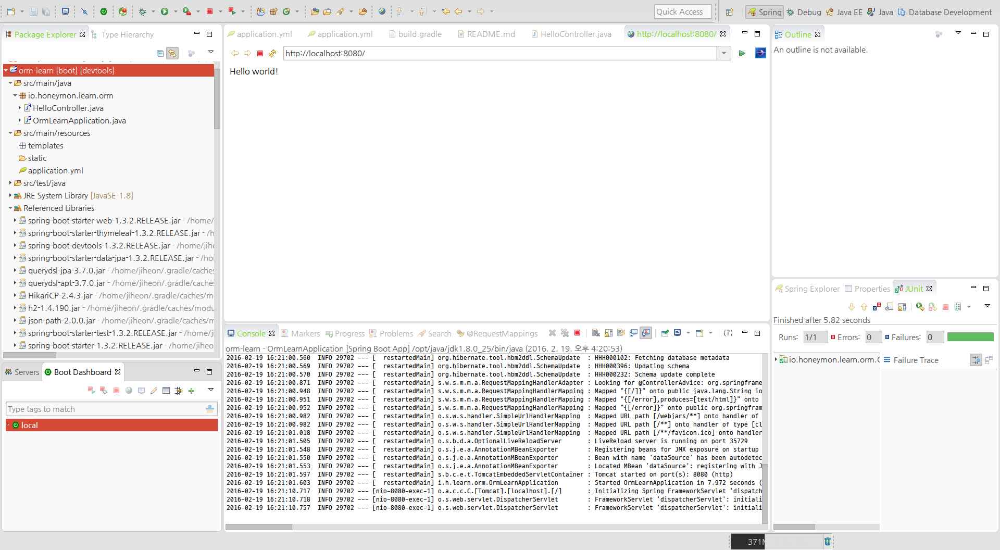
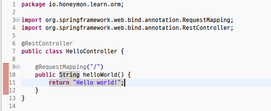

SpringBoot & ORM(Spring Data JPA + QueryDSL)을 익히기 위한 기본 프로젝트
========================================================================

# 프로젝트 소개
스프링부트SpringBoot 를 기반으로 빠르게 스프링부트 개발환경을 익혀보는 것을 목적으로 하여 기본적인 의존성을 정의한 프로젝트다.
ORM(Object Relation Mapping) 프레임워크인 Hibernate를 기반으로 하여 애플리케이션 개발한다는 전제하에 H2Database를 내장DB로 사용한다.
H2Database는 사용자홈디렉토리 아래에 `.h2database/orm-learn` 이라는 파일이 생성된다.

## 애플리케이션을 시작하는 방법은 간단하다.
1. 프로젝트를 선택하고 우클릭 - [Run As]-[Spring Boot App] 하여 실행
	![프로젝트를 선택하고 우클릭 - [Run As]-[Spring Boot App]](./images/spring-boot-start-001.png)
2. 브라우저를 이용해서 http://localhost:8080 접근
	
3. `HelloController` 클래스
	

***
# 사용된 라이브러리
* [SpringBoot 1.3.2.RELEASAE](http://docs.spring.io/spring-boot/docs/1.3.2.RELEASE/reference/htmlsingle/)
  * [Spring Framework 4.2.4.RELEASE](http://docs.spring.io/spring/docs/4.2.4.RELEASE/spring-framework-reference/htmlsingle/)
  	* [스프링 프레임워크...](https://gist.github.com/ihoneymon/594bf76682bc0e29e9f5)
  	>	자바를 기반으로 한 경량엔터프라이즈 개발플랫폼  	
  	
  * [Hibernate 4.3.11](http://hibernate.org/orm/documentation/4.3/)
  * [Spring Data JPA](http://docs.spring.io/spring-data/jpa/docs/1.9.2.RELEASE/reference/html/)
  * [Querydsl 3.7.0](http://www.querydsl.com/static/querydsl/3.7.0/reference/html/)
  * [Thymeleaf (2.1)](http://www.thymeleaf.org/documentation.html)
  	HTML5 로 구성되는 화면구성 템플릿엔진
  	
* [H2Database 1.4.190](http://www.h2database.com/html/main.html)
* [HikariCP 2.4.3](https://brettwooldridge.github.io/HikariCP/)
* [Gradle 2.10](https://docs.gradle.org/current/release-notes)

# 관련학습정보
* [Java - 생활코딩](https://opentutorials.org/module/516/4551)
* [DVCS(Distributed Version Controll System) - Git](http://pcottle.github.io/learnGitBranching/)
* [SpringBoot 아무고나-백기선](https://www.youtube.com/playlist?list=PLCpTH9CC0WwZlwiefbaUlG9jp344RedMd)
* [스프링부트 소개 - 김지헌](https://www.youtube.com/watch?v=suG19ZUF9bE)
* [클린코더스 - 백명석](https://www.youtube.com/playlist?list=PLagTY0ogyVkIl2kTr08w-4MLGYWJz7lNK)