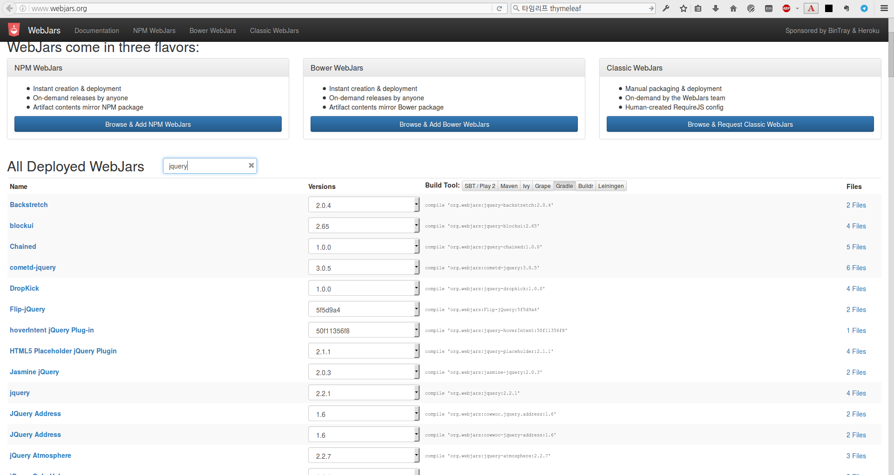
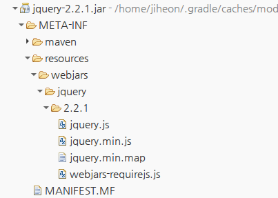

Thymeleaf 이야기
===============

# 타임리프Thymeleaf 소개
타임리프thymeleaf 는 자바 라이브러리이며, 웹과 웹이 아닌 환경 양쪽에서 텍스트, HTML, XML, Javascript, CSS 그리고 텍스트를 생성할 수 있는 **템플릿 엔진**이다. 웹 애플리케이션에서 **뷰View 계층** 에 보다 적합하지만, 오프라인 환경에서 많은 형태로 처리가 가능하다.

스프링 MVC와의 통합 모듈을 제공하며, 애플리케이션에서 JSP로 만든 기능들을 완전히 대체할 수 있다.

타임리프의 목표는 세련되고 잘다듬어진 템플릿을 제공하는 것이다. **Standard**와 **SpringStandard**를 통해서 강력하고 자연스러운 테플릿을 만들어낼 수 있어 정적 프로토타입도 브라우저에서 정확하게 동작한다. 거기서 더 나아가 다이얼렉트dialect를 개발하여 타임리프를 확장할 수 있다.

현재 타임리프의 안정화 버전은 **2.1.4.RELEASE** 이며, 조만간 3.0 버전이 출시할 예정이다.

# 타임리프 기능
## 주요기능
* XML, XHTML 그리고 HTML5 를 위한 자바 템플릿 엔진이다. 다른 템플릿 포멧으로 확장가능함
* 웹과 비웹(오프라인) 양쪽 환경에서 동작, 서블릿 API에 대한 강한 의존성 없음
* 방언**dialects**라고 불리는 **기능 셋** 모듈을 기반으로 함
  * 방언 기능(예: 조건식, 반복문, 기타 등등) 은 템플릿의 태그tag와 속성attributes 에 연결된다.
  * 두 방언은 기본 사용가능: *Standard* 그리고 *SpringStandard*(Spring MVC 앱을 위한, *Standard*와 같은 문법)
  * 개발자가 사용자정의한 방언을 만들어 확장가능
* 다양한 템플릿 모드 제공(확장가능)
  * **XML**: DTD 에 기대어 혹은 그렇지 않은 것 확인
  * **XHTML 1.0 그리고 1.1**: 표준 DTD 에 기대어 혹은 그렇지 않은 것 확인
  * **HTML5**: XML 형태의 코드와 기존의 HTML5 기반 둘다. 기존의 XML 형태가 아닌 코드는 자동으로 정리되고 XML 형태로 변환
* 완벽한(그리고 확장가능한) **국제화** 지원
* 높은 성능의 파싱된 템플릿 캐시를 설정하여 입력/출력을 줄여 최소화
* 자동으로 `DOCTYPE` 번역 - 템플릿 DTD 로 결과 DTD 처리 - 템플릿과 결과 코드를 확인
* 극적인 확장기능: 필요하다면 **템플릿 엔진 프레임워크**를 사용할 수 있음
* 다양한 예제 애플리케이션을 포함한 문서화 완료

## 표준 그리고 스프링표준 방언 Standard and SpringStandard Dialects
* XML, XHTML 1.0, XHTML 1.1 그리고 **HTML5** 지원
* **JSP** 같은 뷰 계층 웹 기술에 완벽한 최적화
* 쉬운 사용성, 오직 애트리뷰트attribute 에 대한 훌륭한 문법제공(방언에는 태그가 포함되어 있지 않음)
  * 웹 템플릿으로의 뛰어남 `<mylib:text field="name" />` 대신에 `<input type="text" th:field="*{name}" />`
* 쉬운 프로토타이핑을 위한 자연스런 템플릿 처리: 브라우저에서 템플릿이 정적으로 노출된다(웹 서버를 실행하지 않은 상태)
* 표현식 지원: **OGNL**(Standard) 과 **스프링 표현식 언어Spring Expression Language** (SpringStandard)
* 스프링 MVC 완벽 통합(SpringStandard): 폼 연동, 프로퍼티 에디터, 국제화, 기타 등등
* **스프링 시큐리티** 지원
* **스프링 웹플로우** 지원(AJAX 이벤트 포함)
* 템플릿 로직 완벽지원: 반복문, 조건문 처리, 컨텍스트 변수 정의, 기타등등
* 레이아웃에 대한 다양한 선택사항(컴포지트 뷰 패턴 **Composite View** pattren)
  * 빌트인 메카니즘 (타임리프의 기본적인 프레그먼트 포함)
  * 아파치 타일즈 통합 정의(extra 패키지를 통해)
  * 사이트매쉬SiteMesh 를 통해서 사용가능
* **국제화Internationalization** 지원: 템플릿 안에 확장된 메시지를 쉽게 포함시킬 수 있음
* **URL rewriting** 켄텍스트와 세션 정보를 추가하여 URL를 구현
* 자바스크립트와 다트 내포: 자바스크립트/다트 코드 표현식에 대한 지능적인 표현 가능
* XML, XHTML 1.0 그리고 XHTML 1.1 에 관한 템플릿 **검증 지원**

## 확장성Extensibility
* 방언:
  * 기본: *Standard* 그리고 *SpringStandard*
  * 새로운 사용자정의 방언을 만들기도 하고, 기존에 있는 것을 확장할 수 있음
  * 동시에 여러 방언을 사용가능
* 템플릿 재현 Template resolution:
  * 기본: 템플릿은 클래스로더 혹은 서블릿컨텍스트 자원을 읽을 수 있음, 파일도 되고(파일 시스템을 기반으로), URL을 호출하는 것도 가능
  * 사용자정의 리졸버resover를 개발가능
* 국제화를 위한 메시지 재현 Message resolution (for internationalization):
  * 기본:
    * *Standard* 방언: 각 템플릿은 `.properties` 로부터 메시지를 재현가능
    * *SpringStandard* 방언: 스프링 `MessageSource` 객체로부터 메시지를 재현가능    
  * 사용자정의 메시지 리졸버 개발가능
* 템플릿 모드Template modes:
  * 기본: `XML`, `VALIDXML`, `XHTML`, `XHTML`, `VALIDXHTML`, `HTML5` 그리고 `LEGACYHTML5`
  * DOM 트리처럼 모델을 확장할 수 있는, parser와 writer를 제공
* 캐시 관리Cache management:
  * 기본: 템플릿, 코드 프레그먼트, 메시지와 표현식에 대한 포괄적이고 강력한 캐시처리 지원
  * 표준 캐시 전략을 변경확장하거나 특정목적에 따라 만들어낼 수 있음
* 확장을 통한 이득Advantages obtained through extension:
  * 존재하는 방언을 이용하여 특정 요구기능을 추가가능
  * 재사용 가능한 뷰 계층 컴포넌트 생성(ex: *JSP taglibs*)
  * 사용자가 애플리케이션에 적합한 형태로 사용자정의 템플릿 시스템 생성가능

# 프로젝트에 Thymeleaf 적용
## thymeleaf 의존성 추가
* `build.gradle` 에 `org.springframework.boot:spring-boot-starter-thymeleaf` 를 추가한다.
  ```groovy
  // 코드중략
  dependencies {
    // 코드중략
    compile "org.springframework.boot:spring-boot-starter-thymeleaf"
    // 코드중략
  }
  // 코드중략
  ```

## 템플릿 파일 위치
* `src/main/resources/template` 하위에 기능에 따라서 디렉터리를 나누고 구성
* 공통으로 사용되는 템플릿 프레그먼트들은 `layout`, `commons` 혹은 `fragments` 에 추가


## `Controller` 에서 사용

### 템플릿파일 `index.html` 생성
```html
<!DOCTYPE html PUBLIC "-//W3C//DTD XHTML 1.0 Strict//EN" "http://www.w3.org/TR/xhtml1/DTD/xhtml1-strict.dtd">
<html>
<head>
<meta charset="UTF-8"/>
<title>Index: ORM learning programming</title>
</head>
<body>
	<h1>Made by honeymon</h1>
	<div>
		<div>Very simple!</div>
		<!-- SpEl: Spring Expression Language 사용 -->
		<div th:text="${greeting}">Greeting</div>
	</div>
</body>
</html>
```

### 템플릿 파일 `index.html`을 전달하는 뷰 계층을 처리하는 `RootController` 코드
`/` 경로에 대한 요청이 있으면 스프링 디스패처서블릿DispatcherServlet에 의해서 해당 요청을 처리할 수 있는지를 탐색하여 `RootController` 에 정의되어 있는 `@RequestMapping("/")` 정의되어 있는 메서드를 호출한다.

```java
package io.honeymon.learn.orm;

import org.springframework.stereotype.Controller;
import org.springframework.ui.Model;
import org.springframework.web.bind.annotation.RequestMapping;

@Controller
public class RootController {

    @RequestMapping("/")
    public String viewIndex(Model model) {
        model.addAttribute("greeting", "Hello, world!");
        return "index";
    }
}
```

## `webjars` 를 이용한 정적자원(jquery, bootstrap 등) 버전관리

webjar는 클라이언트에서 사용되는 웹 라이브러리(jquery, bootstrap) 를 JAR(Java archive) 파일에 압축한 것이다.
  * JVM 기반의 웹 애플리케이션에서 클라이언트 의존성 관리하기가 용이하다.
  * JVM  기반의 빌드도구를 통해서 클라이언트측 의존성 라이브러리를 내려받을 수 있다.
  * 클라이언트에서 사용하는 라이브러리의 의존성을 확인하기 용이하다.
  * 의존성을 투명하게 관리할 수 있으며 `RequireJS` 를 통해서 선택적으로 적재가능하다.
  * 메이븐 중앙 저장소에 배포된다.
  * [JSDELIVR](http://www.jsdelivr.com/)에 의해 공개 CDN도 제공한다.

> 다운받은 jar 파일을 열어보면 그 안에는 `webjars-requirejs.js` 파일이 위치해 있다. [RequireJS](http://requirejs.org/) 를 이용해서 특정 라이브러리를 빌드과정에서 끌어오는 형태로 보인다.

[http://www.webjars.org/](http://www.webjars.org/) 에서 필요한 클라이언트측 웹 라이브러리를 탐색하여 빌드 스크립트에 추가하는 것만으로 빌드도구가 메이븐 중앙저장소에서 내려받아 프로젝트에 빌드시 추가해준다. 클라이언트 웹 라이브러리에 대한 의존성을 개발자나 아키텍트가 프로젝트의 정적자원으로 관리하는 부담을 줄일 수 있다.

* jquery와 bootstrap 의존성 추가: build.gradle
  ```
  dependencies {
      //코드생략
      // webjars
      compile 'org.webjars:jquery:2.2.1'
      compile 'org.webjars:bootstrap:3.3.6'
      //코드생략
  }
  ```
  이렇게하고 프로젝트를 갱신하면 참조라이브러리에 추가되어 있는 `jquery.2.2.1.jar` 와 `bootstrap.3.3.6`를 확인할 수 있다.
  


## 자바스크립트 조건식 처리 중 문법 오류 대처
타임리프의 템플릿 파일이 파싱되는 과정에서 타임리프 템플릿 파서에서 예외를 던지는 상황이 생긴다. 주로 템플릿 파일에 템플릿 조건식에 사용되는 표현식이 자바스크립트에 영역에서, 자바스크립트를 작성하면서 조건식을 사용하는 경우, `&` 등이 들어가는 경우 그러한데, 이를 해결하기 위한 방법은 크게 두 가지가 있다.

* `<![CDATA[ ... ]]>` 구문을 이용하는 방
  ```html
  <html>
    <head>
    ...
    </head>
    <body>
      <script>
      /* <![CDATA[ */
        var bindCheckLogic = function() {
          if(a < b && b < c )  {
            ...
          }
        };

        $(document).ready(function() {
          bindCheckLogic();
          //....
        });
      /* ]]> */
      </script>
    </body>
  </html>
  ```
  * 참고: [12.2 Script inlining (JavaScript and Dart)](http://www.thymeleaf.org/doc/tutorials/2.1/usingthymeleaf.html#script-inlining-javascript-and-dart)

* 별도의 `.js` 파일로 작성하여 템플릿에서 스크립트 소스로 읽어오는 방법
  * 템플릿 파일에서는 `js/test.js` 를 리소스로 호출
  ```html
  <html>
    <head>
    ...
    </head>
    <body>
      <script th:src="@{js/test.js}"></script>
    </body>
  </html>
  ```
  * `js/test.js` 처리  
    ```javascript
    var bindCheckLogic = function() {
      if(a < b && b < c )  {
        ...
      }
    };

    $(document).ready(function() {
      bindCheckLogic();
      //....
    });
    ```

## 메일 템플릿
### 메일발송을 위한 구성Configuration
```java
@Configuration
public class MailConfiguration {
    private static final String MAIL_TEMPLATE_ENCODING_UTF_8 = "UTF-8";
    private static final String MAIL_TEMPLATE_MODE_HTML5 = "HTML5";
    private static final String MAIL_TEMPLATE_SUFFIX = ".html";
    private static final String MAIL_TEMPLATE_PREFIX = "mails/";
    private static final String MAIL_DEBUG = "mail.debug";
    private static final String MAIL_SMTP_STARTTLS_REQUIRED = "mail.smtp.starttls.required";
    private static final String MAIL_SMTP_AUTH = "mail.smtp.auth";
    private static final String MAIL_SMTP_STARTTLS_ENABLE = "mail.smtp.starttls.enable";

    @Resource
    private MailProperties mailProperties;

    @Bean
    public JavaMailSender mailSender() {
        JavaMailSenderImpl mailSender = new JavaMailSenderImpl();
        mailSender.setHost(mailProperties.getHost());
        mailSender.setProtocol(mailProperties.getProtocol());
        mailSender.setPort(mailProperties.getPort());
        mailSender.setUsername(mailProperties.getUsername());
        mailSender.setPassword(mailProperties.getPassword());
        mailSender.setDefaultEncoding(mailProperties.getDefaultEncoding());

        Properties properties = mailSender.getJavaMailProperties();
        properties.put(MAIL_SMTP_STARTTLS_REQUIRED, mailProperties.getSmtp().isStartTlsEnable());
        properties.put(MAIL_SMTP_STARTTLS_ENABLE, mailProperties.getSmtp().isStartTlsEnable());
        properties.put(MAIL_SMTP_AUTH, mailProperties.getSmtp().isAuth());
        properties.put(MAIL_DEBUG, true);
        mailSender.setJavaMailProperties(properties);
        return mailSender;
    }

    @Bean
    public TemplateResolver emailTemplateResolver() {
        TemplateResolver emailTemplateResolver = new ClassLoaderTemplateResolver();
        emailTemplateResolver.setPrefix(MAIL_TEMPLATE_PREFIX);
        emailTemplateResolver.setSuffix(MAIL_TEMPLATE_SUFFIX);
        emailTemplateResolver.setTemplateMode(MAIL_TEMPLATE_MODE_HTML5);
        emailTemplateResolver.setCharacterEncoding(MAIL_TEMPLATE_ENCODING_UTF_8);
        emailTemplateResolver.setCacheable(true);
        return emailTemplateResolver;
    }
}
```

### 메일 서비스
* `MailService` 소스
  ```java
  import java.util.List;

  import org.springframework.mail.MailException;

  /**
   * MailService
   *
   * @author jiheon
   *
   */
  public interface MailService {

      /**
       * 단건 {@link MailMessage} 발송
       *
       * @param message
       * @throws MailException
       */
      void send(MailMessage message) throws MailException;

      /**
       * 복수건 {@link MailMessage} 발송
       *
       * @param messages
       * @throws MailException
       */
      void send(List<MailMessage> messages) throws MailException;
  }
  ```

  * `MailServiceImpl` 소스
  ```java
  import java.util.List;
  import java.util.Locale;

  import javax.mail.MessagingException;
  import javax.mail.Session;
  import javax.mail.internet.MimeMessage;

  import org.springframework.beans.factory.annotation.Autowired;
  import org.springframework.mail.MailException;
  import org.springframework.mail.javamail.JavaMailSender;
  import org.springframework.mail.javamail.MimeMessageHelper;
  import org.springframework.stereotype.Service;
  import org.springframework.util.StringUtils;
  import org.thymeleaf.TemplateEngine;
  import org.thymeleaf.context.Context;

  import lombok.extern.slf4j.Slf4j;

  @Slf4j
  @Service
  public class MailServiceImpl implements MailService {
      @Autowired
      private JavaMailSender mailSender;
      @Autowired
      private SystemMailService systemMailService;
      @Autowired
      private TemplateEngine templateEngine;

      @Override
      public void send(MailMessage message) throws MailException {
          sendMail(message);
      }

      private void sendMail(MailMessage message) {
          try {
              log.debug(">> Send mailMessage: {}", message);
              if (ThymeleafMailMessage.class.isAssignableFrom(message.getClass())) {
                  doThymeleafMailMessageSend((ThymeleafMailMessage) message);
              } else {
                  doSend(message);
              }
          } catch (Exception e) {
              log.error(">> Occur Exception: {}", e.getMessage());
          }
      }

      private void doThymeleafMailMessageSend(ThymeleafMailMessage thymeleafMailMessage) throws MessagingException {
          Context context = new Context(Locale.getDefault());
          context.setVariables(thymeleafMailMessage.getAttributes());
          thymeleafMailMessage.setText(templateEngine.process(thymeleafMailMessage.getTemplateName(), context));

          doSend(thymeleafMailMessage);
      }

      private void doSend(MailMessage message) throws MessagingException {
          if (systemMailService.existSystemMail()) {
              mailSender = systemMailService.getMailSender();
          }
          try {
              MimeMessage mimeMessage = new MimeMessage(Session.getInstance(System.getProperties()));
              MimeMessageHelper helper = getMimeMessageHelper(message, mimeMessage);
              mailSender.send(helper.getMimeMessage());
          } catch (MessagingException e) {
              throw e;
          }
      }

      @Override
      public void send(List<MailMessage> messages) throws MailException {
          for (MailMessage mailMessage : messages) {
              sendMail(mailMessage);
          }
      }

      private MimeMessageHelper getMimeMessageHelper(MailMessage message, MimeMessage mimeMessage)
              throws MessagingException {
          MimeMessageHelper mimeMessageHelper = makeMessageHelper(message, mimeMessage);
          mimeMessageHelper.setFrom(message.getFrom());
          mimeMessageHelper.setTo(message.getTo());
          if (null != message.getCc()) {
              mimeMessageHelper.setCc(message.getCc());
          }
          if (null != message.getBcc()) {
              mimeMessageHelper.setBcc(message.getBcc());
          }

          mimeMessageHelper.setSubject(message.getSubject());
          mimeMessageHelper.setText(message.getText(), message.isHtmlContent());
          mimeMessageHelper.setSentDate(message.getSentDate());
          return mimeMessageHelper;
      }

      private MimeMessageHelper makeMessageHelper(MailMessage message, MimeMessage mimeMessage) throws MessagingException {
          MimeMessageHelper helper = new MimeMessageHelper(mimeMessage, message.isMultipart());
          if (StringUtils.hasText(message.getEncoding())) {
              helper = new MimeMessageHelper(mimeMessage, message.isMultipart(), message.getEncoding());
          }
          return helper;
      }
  }
  ```

  * `ThymeleafMailMessage` 소스: `MailService` 에서 EmailViewResolver 에 정보를 담아 전달하기 위한 목적으로 사용하는 DTO 객체
  * `MailConfiguration` 에서 `emailTemplateResolver` 를 별도로 정의하였다.
  ```
  import java.util.Map;

  import com.google.common.collect.Maps;

  import lombok.Data;
  import lombok.EqualsAndHashCode;
  import lombok.Getter;
  import lombok.ToString;

  /**
   * Thymeleaf MailMessage
   *
   * @author jiheon
   *
   */
  @Data
  @EqualsAndHashCode(callSuper = true)
  @ToString(callSuper = true)
  public class ThymeleafMailMessage extends MailMessage {
      private static final long serialVersionUID = -2313892947287620959L;
      @Getter
      private final String templateName;
      private final Map<String, Object> attributes;

      public ThymeleafMailMessage(String templateName) {
          this.templateName = templateName;
          this.attributes = Maps.newHashMap();
          super.setHtmlContent(true);
      }

      public ThymeleafMailMessage addAttribute(String key, Object value) {
          this.attributes.put(key, value);
          return this;
      }

      public ThymeleafMailMessage removeAttribute(String key) {
          if (this.attributes.containsKey(key)) {
              this.attributes.remove(key);
          }
          return this;
      }

      public Map<String, Object> getAttributes() {
          return java.util.Collections.unmodifiableMap(this.attributes);
      }
  }
  ```

### 메일 템플릿
```html
<!DOCTYPE html>
<html xmlns:th="http://www.thymeleaf.org">
  <head>
    <title th:remove="all">Template for HTML email with inline image</title>
    <meta http-equiv="Content-Type" content="text/html; charset=UTF-8" />
  </head>
  <body>
  	<h1>Test mail</h1>
  	<p>
  	  This mail is test mail.
  	</p>
    <p>
      Host: <span th:text="${serverName}"></span>      
    </p>
    <p>      
      <em>The InnoQuartz Team</em>
    </p>
  </body>
</html>
```


# 참고
* [Thymeleaf Reference Document](http://www.thymeleaf.org/documentation.html)
* [CDATA 섹션 [XML표준]](https://msdn.microsoft.com/ko-kr/library/ms256076%28v=vs.120%29.aspx)
